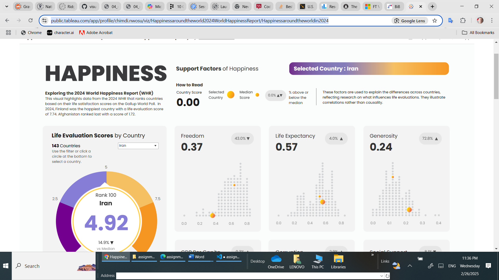
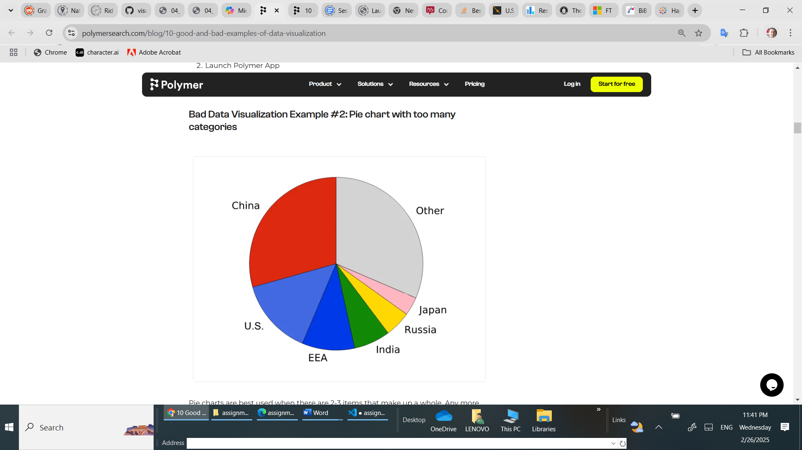

# Data Visualization

## Assignment 2: Good and Bad Data Visualization

### Requirements:

- Data visualizations are important tools for communication and convincing; we need to be able to evaluate the ways that data are presented in visual form to be critical consumers of information 
- To test your evaluation skills, locate two public data visualizations online, one good and one bad  
    - You can find data visualizations at https://public.tableau.com/app/discover or https://datavizproject.com/, or anywhere else you like! 
- For each visualization (good and bad):  
    - Explain (with reference to material covered up to date, along with readings and other scholarly sources, as needed) why you classified that visualization the way you did.
      ```
      Your answer...
# Comparing Two Data Visualizations: Good and Bad
# Visualization 1: "Happiness Around the World 2024"
Source: Happiness Around the World 2024
# https://public.tableau.com/app/profile/chimdi.nwosu/viz/Happinessaroundtheworld2024WorldHappinessReport/Happinessaroundtheworldin2024


Pros:
# Interactive Design: 
The interactive map allows users to explore data by hovering over different countries, which provides immediate access to detailed information. This interactive feature engages the user and makes the data exploration process intuitive and user-friendly.
# Comprehensive Data Representation: 
This visualization incorporates various happiness-related metrics, offering a holistic view of the factors contributing to happiness across different countries. It goes beyond simple happiness scores to include aspects like GDP, social support, and life expectancy, giving users a well-rounded understanding.
# Effective Use of Color: 
The color scheme is thoughtfully chosen, with different shades representing varying levels of happiness. This helps in quickly identifying patterns and differences across regions.
# Clear Labels and Tooltips: 
The visualization includes clear labels and tooltips that provide additional context and information when users interact with the map. This ensures that users can easily interpret the data without confusion.
# Engaging Visual Appeal: 
The overall design is visually appealing, making the visualization more engaging and likely to retain the user's attention.

Cons:
# Potential Overload of Information: 
While the comprehensive data representation is a strength, it can also be overwhelming for some users. The inclusion of multiple metrics might make it challenging for users to focus on a specific aspect of the data.
# Dependence on Internet Connectivity: 
The interactive features require a stable internet connection. Users with limited or unstable connectivity might face issues accessing the full functionality of the visualization.
# Learning Curve for New Users: 
Users who are not familiar with interactive maps or data visualization tools might need some time to understand how to navigate and interpret the visualization effectively.

# Visualization 2: Pie Chart with Too Many Categories
Source: Polymer
# https://www.polymersearch.com/blog/10-good-and-bad-examples-of-data-visualization

Pros:
# Simple Representation: 
Pie charts are often used for their simplicity and ease of understanding, especially when dealing with a small number of categories.

# Quick Comparison: 
For datasets with a few categories, pie charts allow for quick visual comparison of proportions.

Cons:
# Cluttered Design: 
In this example, the pie chart has too many categories, making it difficult for users to distinguish between the parts of the circle. This cluttered design obscures the data's meaning and reduces the effectiveness of the visualization.
# Poor Choice of Chart Type:
Pie charts are not well-suited for datasets with many categories. Alternative visualization techniques, such as bar charts or treemaps, would have been more effective in presenting the data clearly.
# Limited Information: 
Pie charts provide limited information and do not convey relationships between data points or trends over time. This limitation makes it challenging to derive meaningful insights from the data.
# Color Overload: 
The use of many colors to represent different categories can be overwhelming and confusing for viewers. It becomes challenging to associate colors with specific categories, leading to potential misinterpretation of the data.
# Lack of Interactivity: 
The static nature of the pie chart does not allow for interaction or deeper exploration of the data. Users are restricted to the initial view without the ability to drill down into specific categories or segments.

# Conclusion
Comparing the "Happiness Around the World 2024" visualization with the pie chart example highlights the importance of choosing appropriate visualization techniques and design elements to effectively communicate data. The interactive map excels in providing a comprehensive, engaging, and user-friendly experience, while the pie chart example demonstrates the pitfalls of poor chart selection and cluttered design. By understanding the strengths and weaknesses of each visualization, we can develop better data visualization practices to enhance clarity, accuracy, and user engagement.


      ```
    - How could this data visualization have been improved?  
      ```
      Your answer...
# Improving the Pie Chart

# Limit Categories: 
Reduce categories to avoid clutter.
# Alternative Chart Types: 
Use bar charts or treemaps.
# Consistent Color Scheme: 
Enhance readability.
# Interactive Features: 
Add tooltips or hover effects.
# Clear Labels: 
Ensure legibility.
# Focus on Key Insights: 
Highlight important data.
# Provide Context: 
Include title, description, and legend.

# Improving "Happiness Around the World 2024"

# Increase Interactivity: 
Add filtering options for specific factors.
# Add Comparison Features: 
Enable side-by-side country comparisons.
# Incorporate Time Series Data: 
Show trends over years.
# Enhance Data Explanation: 
Include more detailed insights.
# Improve Accessibility: 
Add features like keyboard navigation.
# Optimize Mobile Compatibility: 
Ensure responsive design.
# Provide Data Export Options: 
Allow data download for further analysis.

By making these enhancements, the visualization can become even more informative, engaging, and user-friendly.


      
      ```
- Word count should not exceed (as a maximum) 500 words for each visualization (i.e. 
300 words for your good example and 500 for your bad example)

### Why am I doing this assignment?:

- This assignment ensures active participation in the course, and assesses the learning outcomes
* Apply general design principles to create accessible and equitable data visualizations
* Use data visualization to tell a story

### Rubric:

| Component               | Scoring   | Requirement                                                 |
|-------------------------|-----------|-------------------------------------------------------------|
| Data viz classification and justification | Complete/Incomplete | - Data viz are clearly classified as good or bad<br />- At least three reasons for each classification are provided<br />- Reasoning is supported by course content or scholarly sources |
| Suggested improvements  | Complete/Incomplete | - At least two suggestions for improvement<br />- Suggestions are supported by course content or scholarly sources |

## Submission Information

🚨 **Please review our [Assignment Submission Guide](https://github.com/UofT-DSI/onboarding/blob/main/onboarding_documents/submissions.md)** 🚨 for detailed instructions on how to format, branch, and submit your work. Following these guidelines is crucial for your submissions to be evaluated correctly.

### Submission Parameters:
* Submission Due Date: `23:59 - 02/03/2025`
* The branch name for your repo should be: `assignment-2`
* What to submit for this assignment:
    * This markdown file (assignment_2.md) should be populated and should be the only change in your pull request.
* What the pull request link should look like for this assignment: `https://github.com/<your_github_username>/visualization/pull/<pr_id>`
    * Open a private window in your browser. Copy and paste the link to your pull request into the address bar. Make sure you can see your pull request properly. This helps the technical facilitator and learning support staff review your submission easily.

Checklist:
- [ ] Create a branch called `assignment-2`.
- [ ] Ensure that the repository is public.
- [ ] Review [the PR description guidelines](https://github.com/UofT-DSI/onboarding/blob/main/onboarding_documents/submissions.md#guidelines-for-pull-request-descriptions) and adhere to them.
- [ ] Verify that the link is accessible in a private browser window.

If you encounter any difficulties or have questions, please don't hesitate to reach out to our team via our Slack. Our Technical Facilitators and Learning Support staff are here to help you navigate any challenges.
